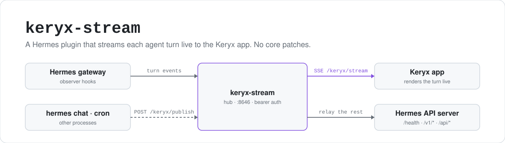

<p align="center">
  <picture>
    <source media="(prefers-color-scheme: dark)" srcset="assets/hero-dark.svg">
    
  </picture>
</p>

<p align="center">
  <a href="https://github.com/CocaKova/keryx-stream/actions/workflows/ci.yml"></a>
  
  
  <a href="LICENSE"></a>
</p>

keryx-stream is the server half of [Keryx](https://github.com/CocaKova/keryx), an Android client for
[Hermes](https://github.com/NousResearch/hermes-agent) agents. A chat transport such as Matrix delivers
one message per turn, not a token stream. This plugin subscribes to the observer hooks Hermes ships and mirrors each
turn (text and reasoning tokens, tool calls with inline edit diffs, usage, compaction status,
subagents) to a Server-Sent Events side-channel that the app renders live. The chat transport still
gets one final message. The plugin also serves the routes behind the app's hub panels: the reasoning
dial, Missions, the Shipyard, the config editor, skills.

It runs on the public plugin surface only. Nothing in the hermes-agent tree is patched.

keryx-stream is a personal project and is not affiliated with or endorsed by Nous Research.

## Install

From a clone. The package is not published on PyPI.

```bash
git clone https://github.com/CocaKova/keryx-stream.git
cd keryx-stream
./install.sh            # symlinks the package into ~/.hermes/plugins/ (or --copy)
hermes plugins enable keryx-stream
hermes gateway restart
curl -s localhost:8646/keryx/health    # {"ok": true, "version": "0.5.0", "features": [...]}
```

`install.sh` honors `HERMES_HOME` and prints the config block and the token you still need to set.
Hermes loads a user plugin only once it is **enabled**; without that step the plugin is discovered and
ignored. `hermes plugins list` shows its status, and after a Hermes update `hermes plugins compat`
reports any import this plugin uses that the update retired.

Then in Keryx, Settings → **Hermes Link**: Gateway URL `http://<host>:8646`, your key, **Test link**.

<details>
<summary>Other ways to install</summary>

**Directory install by hand.** Symlink (or copy) the package into your plugins directory:

```bash
ln -s "$PWD/keryx_stream" ~/.hermes/plugins/keryx_stream
```

**pip, from the clone.** Hermes discovers it through the `hermes_agent.plugins` entry point:

```bash
pip install -e .
```

</details>

## One URL for the app

The plugin runs its own HTTP server (default `:8646`, bearer auth) and adds no route to the gateway's
API server. The app has a single gateway URL, so the plugin answers `/keryx/*` itself and relays every
other path to `keryx_stream.upstream_url`. That defaults to `http://127.0.0.1:$API_SERVER_PORT`, so
`:8642` unless you changed it.

The relay never widens access. A request has to pass the plugin's bearer check before it is
forwarded (only the bare `/health` probe is open), and it is then sent upstream with `API_SERVER_KEY`.
Set `upstream_url: ""` to turn the relay off.

## Configure

Non-secret settings go in `~/.hermes/config.yaml`. Every key below is optional; the values shown are
the defaults.

```yaml
keryx_stream:
  enabled: true
  host: "0.0.0.0"
  port: 8646
  default_platform: matrix     # platform key used when a turn's metadata omits one
  panels: true                 # serve the app's /keryx/* panel routes
  upstream_url: "http://127.0.0.1:8642"   # native API server to relay to; "" = off
  toolsets:
    locked: []                 # toolsets the app may not disable
    forbidden: []              # toolsets the app may not enable
  config_locked: []            # config knob keys the app may not change
  thinking_kwargs: auto        # reasoning-dial middleware: auto (local custom brains only) | true | false
  stop_hold_ms: 3000           # longest a turn's stop waits for lagging deltas
  stop_quiet_ms: 300           # a wire this quiet after post_llm_call counts as done
  idle_stop_s: 45              # watchdog stop for a turn post_llm_call never ended
  markers:                     # teach the agent Keryx's ⟦…⟧ markers (see below); `markers: false` = off
    enabled: true
    platforms: [api_server, matrix]
```

**The token is a secret**, so it comes from the environment, not this file: set `KERYX_STREAM_TOKEN`,
or reuse your existing `API_SERVER_KEY`. Every route except `/keryx/health` requires
`Authorization: Bearer <token>`, and with no token set the plugin refuses every request.

Not every process that loads the plugin has the gateway's environment. A cron or kanban worker on a
multi-profile gateway starts with a scrubbed one. So the token is looked up in this order: the process
environment, the `.env` of the process's own Hermes home, the active profile's secret scope, and the
`.env` of the routed profile. Nothing found is written back into the environment. A forwarder that
started with no token retries the lookup (at most every 30 s) instead of posting unauthenticated for
the life of the worker.

**Binding.** `host: "0.0.0.0"` lets a phone on your LAN or tailnet reach the port. If the machine is
reachable from networks you don't trust, bind `127.0.0.1` and publish the port through your VPN
(for example `tailscale serve`).

**Hermes knobs for full parity.** `/keryx/health` lists whichever of these are still off under
`hints`, and the gateway logs each one at startup:

```yaml
plugins:
  stream_reasoning_deltas: true   # Hermes hands reasoning tokens to plugins only with this on
compression:
  progress_notices: true          # otherwise a compacting turn reads as a hang
display:
  platforms:
    matrix:
      streaming: false            # Matrix users: the side-channel already carries the tokens;
                                  # edit-streaming would repeat them as m.replace edits
```

`KERYX_THINKING_KWARGS=off` in the environment turns the reasoning middleware off without editing
config.

### Routes that can change the host

Every route needs the bearer token. Beyond that, two features can run commands or touch files outside
Hermes' own state, and both are **off until you configure them**: the Shipyard (git) and brain swaps.
The app only ever sees names and labels, never the commands.

The update button is different: with no configuration it offers Hermes' own recommended update
command (plain `hermes update` on a git checkout). Set `keryx.update.command` if you carry local
patches, or `keryx.update.enabled: false` to remove the button. The commits-behind count is read-only
and always shows.

```yaml
keryx:
  git:
    enabled: true            # Shipyard. Off by default; repos are confined to $HOME
  brains:                    # brain picker swaps. No entries = read-only picker
    - name: my-brain
      command: "/path/to/swap-script"
  update:
    enabled: true            # on by default; false removes the button
    command: "my-update-wrapper"   # default: Hermes' own recommended command
```

## How it works

- `register(ctx)` registers the observer hooks and starts the server on its own daemon thread with
  its own event loop, so it adds no core route.
- `on_stream_end` fires once per API call, so it never ends the turn; `post_llm_call` does. The `stop`
  it produces waits (at most `stop_hold_ms`) until the last delta is on the wire, goes out once, and
  is preceded by the `usage` frame, because the app hangs up at `stop`.
- A turn is published under two keys: `(surface, session_id)`, which is what the hooks carry, and the
  chat it belongs to, `(platform, chat_id)` (for example `matrix` plus the room id), resolved from the
  gateway's session store. The plugin borrows that store through the `pre_gateway_dispatch` hook as an
  observer only. An app on a chat transport only knows the room, so that is the key it subscribes with.
- On a multi-profile gateway each request enters the process profile's secret scope, as the native
  API server does.
- Hook callbacks run on the gateway's stream worker thread and hand tokens to an in-process hub via
  `call_soon_threadsafe`. The SSE handler drains and **coalesces** bursts so a fast model can't
  overflow a subscriber's bounded queue and drop a token, which would break the client's
  stream/commit match.
- Toolsets are read and written through the same `hermes_cli` helpers the desktop picker uses, so the
  app and desktop agree on state.

### Turns from outside the gateway: forward mode

Turns driven from outside the gateway process (a `hermes chat` one-shot, a cron run, any CLI process)
fire the same hooks in their own process, where no subscriber is attached. The plugin picks one of
two modes at startup, with no flag:

- **Hub mode.** This process binds the SSE port (normally the gateway) and serves subscribers.
- **Forward mode.** The port is already bound by another keryx-stream instance, so hook events are
  POSTed to that instance's `/keryx/publish`. A CLI session's deltas and tool events then appear on the
  hub's side-channel like a gateway turn's, keyed by session id: subscribe with
  `GET /keryx/stream?platform=cli&chat_id=<session_id>`.

To point a forwarder at a specific hub (a remote gateway, say), set `forward_url`:

```yaml
keryx_stream:
  forward_url: "http://gateway-host:8646/keryx/publish"
```

The same bearer token authenticates the subscriber's `GET /keryx/stream` and the forwarder's
`POST /keryx/publish`.

## Teaching your agent Keryx's formatting

Keryx renders a few markers that only the model can decide to write: inline source citations,
decision tiles, phone-action tiles. Nothing detects them from plain prose, so the agent has to be told
they exist. On a Hermes with plugin prompt sections (`ctx.register_system_prompt_section`),
keryx-stream registers two sections, each well under Hermes' 4000-character cap:

- `keryx.markers.core`: the client renders GitHub-flavored markdown (tables, fenced code, task lists;
  mermaid `graph`/`flowchart` diagrams are drawn; `$…$` math is shown as Unicode, not typeset),
  `MEDIA:/absolute/path` lines for files, source citations (`⟦c1⟧` inline plus
  `⟦cite 1|kind|label|detail⟧` definitions, kind one of memory, file, web, session; never an invented
  source), and decision tiles (`⟦keryx:ask|A|B⟧` as the message's last line).
- `keryx.markers.hands`: phone actions (`⟦keryx:do|kind|args…⟧`: url, dial, sms, email, calendar,
  alarm, timer, navigate, search, play, open, copy, torch, share; they act only on the user's tap),
  what `⟦keryx:voice⟧` on a user message means (spoken in a call; answer for the ear), and the
  `⟦keryx:sense|…⟧` context tail.

The exact text is in `keryx_stream/markers.py`. The core section says explicitly that this client
renders markdown, because Hermes' own hint for the `api_server` platform asks for plain text.

**Where it applies.** Hermes renders each section once when a session starts and freezes it into that
session's system prompt. Turns reuse the frozen bytes, so prompt caching is unaffected, and a config
change only reaches new sessions. The section is included only when the session's `platform` is in
`keryx_stream.markers.platforms` (default `api_server` and `matrix`). The platform is the only thing
the section sees that says where a chat is read, and it can't tell Keryx from other clients:

- `api_server` also serves any other OpenAI-compatible client. Those clients get the protocol too,
  and anything that doesn't know the markers shows them as literal text.
- Keryx's direct gateway connection creates `tui` sessions, the same platform as Hermes' terminal UI.
  It is not in the default set. Add `tui` if you use the direct connection and accept that terminal
  sessions are taught the markers as well.

```yaml
keryx_stream:
  markers:
    enabled: true                     # false (or `markers: false`) turns it off
    platforms: [api_server, matrix, tui]
```

On a Hermes without prompt sections nothing is registered, the plugin still loads, and
`prompt.markers` is not listed in `/keryx/health`. The app renders the markers whenever they appear,
however the agent learned them. If you already inject your own version of this protocol some other
way, set `enabled: false` so the model is not taught it twice.

## Reference

<details>
<summary>Hooks and what each one feeds</summary>

| hook | what it feeds |
|------|---------------|
| `on_stream_start` / `on_stream_delta` / `on_stream_end` / `on_interim_message` | text and reasoning tokens, segment boundaries (from the per-call `iteration`) |
| `pre_tool_call` / `post_tool_call` | tool rows, and inline edit diffs matched by `tool_call_id` |
| `post_api_request` | the last call's prompt size, for the `usage` frame |
| `post_llm_call` | the end of the turn: exactly one `stop`, held until the last delta is out |
| `subagent_start` / `subagent_stop` | the delegation wing |
| `pre_auxiliary_call` / `post_auxiliary_call` | compaction `status` rows |
| `pre_gateway_dispatch` | borrows the session store so a turn also lands on its chat key (observer only) |
| `llm_request` middleware | the reasoning dial for local brains (vLLM / SGLang / llama.cpp) |

What the hooks cannot feed, and the hook Hermes would need for each, is in [GAPS.md](GAPS.md).

</details>

<details>
<summary>Routes</summary>

| route | purpose |
|-------|---------|
| `GET /keryx/stream?platform=<p>&chat_id=<id>` | transient SSE of one turn: `event: start` / `delta` / `reasoning` / `interim` / `segment` / `tool` / `status` / `usage` / `stop` / `ping` |
| `POST /keryx/publish` | ingest for processes outside the hub (see forward mode) |
| `GET /keryx/health` | liveness, `version`, `requires_hermes`, the derived `features` list and config `hints` (open, no token) |
| `GET`/`PUT /keryx/toolsets[/{name}]` | toolset view and toggle for a platform |
| `GET /keryx/capabilities`, `PUT /keryx/reasoning` | what the active brain accepts on the reasoning dial, and setting it |
| `GET /keryx/commands` | the gateway's slash-command catalog |
| `GET`/`PUT /keryx/config`, `/keryx/config/raw` | whitelisted config knobs; the raw file with hash-guarded, backed-up writes |
| `GET /keryx/brains`, `GET /keryx/model/options`, `POST /keryx/brain` | model picker; operator-defined brain swaps |
| `GET /keryx/logs?lines=` | redacted tail of the gateway log |
| `/keryx/kanban/*` | Missions: board, task detail, create, comment, reply / approve / request-changes, settings, events, notify subscriptions |
| `/keryx/skills/*`, `/keryx/skill-trash/*` | read, write and create skills; delete goes to a restorable trash |
| `POST /keryx/sessions/prune` | preview or prune old sessions |
| `/keryx/pet*` | companion pet: active, gallery, select, thumbnail |
| `GET`/`POST /keryx/update*` | commits-behind count; run the update command |
| `/keryx/git/*` | Shipyard: repos, status, diff review, stage, commit, push |
| anything else | relayed to the native API server (`/health`, `/v1/*`, `/api/*` …) |

</details>

<details>
<summary><code>/keryx/health</code>: features and hints</summary>

```json
{"ok": true, "plugin": "keryx-stream", "version": "0.5.0", "requires_hermes": ">=0.21.3",
 "features": ["stream", "stream.chat_key", "publish", "toolsets", "reasoning", "interim",
              "tools", "tools.diff", "segment", "stop.turn", "usage", "thinking", "..."],
 "hints": [{"key": "compression.progress_notices", "value": true, "why": "..."}]}
```

`features` is worked out at runtime, not hard-coded. A feature is listed only when the running Hermes
provides what it needs: the hook registered, the payload field turned up on a real call, the config
knob is on. Features that depend on events (`usage`, `status`, `subagents`) are listed once such an
event has gone out, including events another process pushed through `POST /keryx/publish`. The app
uses the list to tell "this install cannot do that" from "that is broken".

| feature | listed when |
|---------|-------------|
| `stream`, `stream.chat_key`, `publish`, `toolsets` | always |
| `reasoning` | `on_stream_delta` registered and `plugins.stream_reasoning_deltas: true` |
| `interim` | `on_interim_message` registered |
| `tools` | `pre_tool_call` + `post_tool_call` registered |
| `tools.diff` | a tool call carried `tool_call_id` and Hermes' edit-diff helpers imported |
| `segment` | a stream delta carried `iteration` |
| `stop.turn` | `post_llm_call` registered (one `stop` per turn, not per API call) |
| `usage` / `status` / `subagents` | a frame of that kind has been published |
| `thinking` | the `llm_request` middleware registered |
| `prompt.markers` | the marker prompt sections registered (see [Teaching your agent Keryx's formatting](#teaching-your-agent-keryxs-formatting)) |
| `kanban.run_sessions` | always with the kanban routes: each run in a task detail carries `session_id` (its worker's Hermes session, or `null`) |
| panel names, `proxy` | the panel routes mounted; the relay is on |

`hints` lists the Hermes config knobs that are still off, each with a reason.

</details>

## Requirements and limitations

- Python 3.10+ and `aiohttp` (already in Hermes' environment), and hermes-agent **0.21.3 or newer**.
  `plugin.yaml` declares `requires_hermes: ">=0.21.3"`, so on a directory install an older Hermes
  skips the plugin before importing it and logs why. The code has been checked against the 0.21.3 and
  0.21.5 trees; older releases are untested.
- CI runs lint and the suite on pushes to `main` and on pull requests, and nightly against a fresh
  hermes-agent `main`, so drift in Hermes' plugin surface shows up there first.
- Every hook is checked against the host's `VALID_HOOKS` before registering. Hermes accepts an unknown
  hook name with only a warning, so a hook that would never fire has to be caught here. A hook this
  Hermes lacks is skipped with an info line, and the feature it feeds is not advertised. 0.21.3, for
  example, has no `pre_auxiliary_call` / `post_auxiliary_call`, so it gets no compaction status rows.
  The same goes for the `llm_request` middleware.
- At load Hermes logs `capability_check plugin=keryx-stream capability=tools.override decision=deny`.
  That is expected. The loader checks the tool-override grant for every non-bundled plugin, whatever
  it registers, and keryx-stream registers no tools and overrides none. No grant is needed.
- It is built for Keryx and tested only with it. Any client can read the SSE stream, but the frames
  and `/keryx/*` routes follow what the app needs and change with it.

## Development

```bash
pip install -e '.[dev]'   # or: pip install aiohttp pytest pytest-asyncio
pytest -q
```

The panel tests import Hermes itself and skip without it. Point them at a checkout with
`HERMES_AGENT_ROOT=/path/to/hermes-agent` (default `~/.hermes/hermes-agent`) and run pytest with that
tree's Python. CI also runs `ruff check .`.

It is published as a standalone plugin because Hermes keeps third-party integrations out of core.

## License

[MIT](LICENSE).
